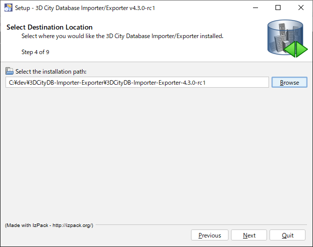
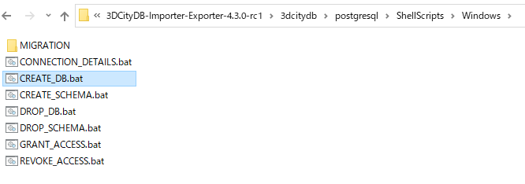

# 書式・概念一貫性検証機能

## 概要

3D都市モデルの品質管理支援のための書式・概念一貫性検証機能の利用方法のチュートリアル文書です。

本ドキュメントで紹介するソフトウェアは、国土交通省の[Project PLATEAU](https://www.mlit.go.jp/plateau/)において3D都市モデルの品質管理支援のため構築した[品質評価システム](https://github.com/Project-PLATEAU/CityGML-evaluation-system)で利用した、ドイツ[virtualcitysystems社](https://vc.systems/en/)のソフトウェア製品[VC Database](https://vc.systems/en/products/vc-database/)の機能の一部です。なお、OSSとしてGitHub上で公開されたものから、i-UR 2.0に対応するべく一部改修を行う必要があります。

* i-UR ADE extension for the 3D City Database: https://github.com/3dcitydb/iur-ade-citydb

対応データ形式は、内閣府地方創生推進事務局が定めた[i-都市再生技術仕様案 v2.0 (iｰUR 2.0)](https://www.chisou.go.jp/tiiki/toshisaisei/itoshisaisei/iur/)に従い拡張された[OGC CityGML 2.0](https://www.ogc.org/standards/citygml)形式です。なお、i-URを利用していない通常のCityGML 2.0形式にも対応しています。

## 動作環境、前提ソフトウェア

本ソフトウェアの動作には前提ソフトウェア（RDBMSソフトウェア）が必要です。下記の動作環境にて前提ソフトウェアをインストール後、以下の利用手順1～5に従いご利用下さい。

動作環境
* Java JRE or JDK >= 1.8 環境（AdoptOpenJDK 11＋Windows 10で動作確認)

前提ソフトウェア（いずれか一方）
* PostgreSQL 9.6以上、及びPostGIS extension 2.3以上（PostgreSQL 12.3、PostGIS 3.0で動作確認）
* Oracle 10g R2以上、及びOracle Spatial又はLocator extension（動作未確認）

---

## 利用手順1：インストール
1. 3D City Databaseの[i-UR 1.4拡張モジュール（i-UR ADE extension for the 3D City Database）GitHubレポジトリ](https://github.com/3dcitydb/iur-ade-citydb)にアクセスし、`Releases`セクション①をクリック。

    

1. i-UR 1.4用モジュール`iur-ade-1.4.0.zip`①、3D City Databaseの`Importer/Exporter`②のリンク先から最新版をダウンロード。

    

1. Importer/Exporterのインストーラを起動。jarファイルをダブルクリック、またはコマンドラインからインストール実行。

    

1. 画面に従いインストール。

    
    
    
    
    
    
    
    
    
    

## 利用手順2：DB作成＋PostGISの拡張機能のロード
1. 画面例はPostgreSQL+PostGISをWindows環境で利用する例

1. PostgreSQLへ接続し、CREATE DATABASEを実行。
    
    
    
1. 作成したcitydb_v4に接続し、CREATE EXTENSIONを実行。
    
    
    
## 利用手順3：DBスキーマ作成
1. 利用手順1でインストールしたフォルダから、環境に適したサブフォルダに移動。画面例はPostgreSQL+PostGISをWindows環境で利用する例。

    

1. `CONNECTION_DETAILS.bat` をテキストエディタで開き、PostgreSQLパス、ホスト名、ポート番号、DB名、ユーザ名を記入し保存。

    

    ※PGUSERをcitydb_userとする場合は別途ユーザーの作成、権限の付与が必要。なお、postgres等のスーパーユーザーでも問題ない。
    ※PGBINにはPostgresSQLパスを入力するが、環境変数の編集にてPostgresSQLパスを登録しておく必要がある。
    
    

1. `CREATE_DB.bat` を実行、座標参照系（SRID）に`6697`と入力。その他はデフォルト値のままで実行。最後にDBパスワードの入力が必要。

    
    

## 利用手順4：3D City Database Importer/Exporter起動
1. 利用手順1のインストール時に作成したショートカットを実行し、ソフトウェアを起動。

    
    

1. `Database`タブ①を開き、Usernameなど②が正しく入力されていることを確認後、Passwordを入力し、`Connect`③をクリック。正しく起動できたことを確認。

    
    

## 利用手順5：i-UR 1.4からi-UR2.0更新
1. 利用手順1でダウンロードしたiur-ade-1.4.0.zipを、Importer/Exporterのインストールフォルダ下の`ade-extensions`フォルダ直下に展開。

    
    
1. 展開したiur-ade-1.4.0のlib内にあるiur-ade-citygml4j-1.4.0.jarを7-zip等の解凍ソフトで解凍。

    
    
1. 解凍すると下記のフォルダが現れる。

    
    
1. 下記のスキーマファイル全てを開き、下記の表に従い置換し、i-URの版を、1.4 から 2.0 に更新する。
    
    
    
    |置換前|置換後|
    | - | - |
    |http://www.kantei.go.jp/jp/singi/tiiki/toshisaisei/itoshisaisei/iur/uro/1.4|https://www.geospatial.jp/iur/uro/2.0|
    |http://www.kantei.go.jp/jp/singi/tiiki/toshisaisei/itoshisaisei/iur/urf/1.4|https://www.geospatial.jp/iur/urf/2.0|
    |http://www.kantei.go.jp/jp/singi/tiiki/toshisaisei/itoshisaisei/iur/urg/1.4|https://www.geospatial.jp/iur/urg/2.0|
    |http://www.kantei.go.jp/jp/singi/tiiki/toshisaisei/itoshisaisei/iur/urt/1.4|https://www.geospatial.jp/iur/urt/2.0|    
    
1. schema-mapping.xmlを開き、4．と同様に置換し、i-URの版を、1.4 から 2.0 に更新する。

    
    
    修正後は下図の通り`<version>1.4</version>`は`<version>2.0</version>`に変更する。
    
    またスキーマファイルと同様、名前空間の記載を変更する。

    

1. Importer/Exporterの`ADE Manager`タブ①を開き、`Browse`②をクリックして上記のiur-ade-1.4.0フォルダを選択し、`Register ADE`をクリックして登録。

    
    

## 利用手順6：書式・概念一貫性検証
1. Importer/Exporterの`Import`タブを開き、`Browse`①をクリックして検証したいCityGMLファイルを選択。なお、複数CityGMLファイルや、複数CityGMLファイルを圧縮したZIPファイルも選択可能。`Just validate`②をクリックし検証実行、検証結果はConsole画面③に出力される。

    

1. エラーが検出された場合、Console画面にエラー発生箇所及び内容が出力される。内容については[ログ内容一覧](doc/log.pdf)を参照のこと。

    

---

## ライセンス

本ドキュメントは[Project PLATEAUのサイトポリシー](https://www.mlit.go.jp/plateau/sitepolicy/)に従い提供されています。

## 注意事項

* 本レポジトリは参考資料として提供しているものです。動作保証は行っておりません。
* 予告なく変更・削除する可能性があります。
* 本レポジトリの利用により生じた損失及び損害等について、国土交通省はいかなる責任も負わないものとします。

## 参考資料

* 3D City Database用i-UR 1.4拡張モジュール（i-UR ADE extension for the 3D City Database）: https://github.com/3dcitydb/iur-ade-citydb
* 3D City Databaseチュートリアル（Hands-on Tutorial for 3DCityDB Beginners）: https://github.com/3dcitydb/tutorials
* 品質評価システム: https://github.com/Project-PLATEAU/CityGML-evaluation-system
* 位相一貫性検証機能: https://github.com/Project-PLATEAU/CityGML-geometry-validator
* モデル自動生成システム: https://github.com/Project-PLATEAU/CityGML-production-system
