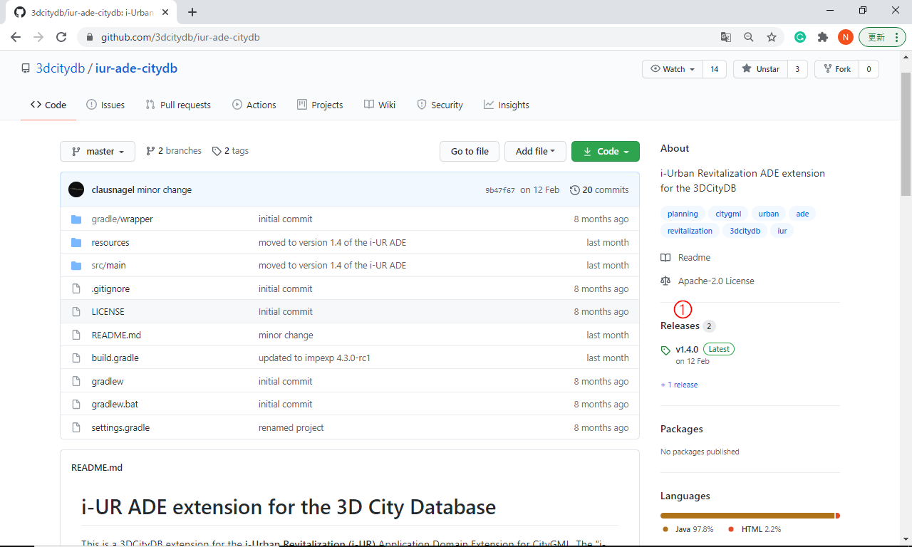

# 書式・概念一貫性検証機能

## 概要

3D都市モデルの品質管理支援のための書式・概念一貫性検証機能の利用方法のチュートリアル文書です。

本ドキュメントで紹介するソフトウェアは、国土交通省の[Project PLATEAU](https://www.mlit.go.jp/plateau/)において3D都市モデルの品質管理支援のため構築した[品質評価システム](https://github.com/Project-PLATEAU/CityGML-evaluation-system)で利用した、ドイツ[virtualcitysystems社](https://vc.systems/en/)のソフトウェア製品[VC Database](https://vc.systems/en/products/vc-database/)の機能の一部です。OSSとしてGitHub上で公開されたため、その使い方を紹介します。virtualcitysystems社に感謝します。

* i-UR ADE extension for the 3D City Database: https://github.com/3dcitydb/iur-ade-citydb

対応データ形式は、内閣府地方創生推進事務局が定めた[i-都市再生技術仕様案 v1.4 (iｰUR 1.4)](https://www.chisou.go.jp/tiiki/toshisaisei/itoshisaisei/iur)に従い拡張された[OGC CityGML 2.0](https://www.ogc.org/standards/citygml)形式です。なお、i-URを利用していない通常のCityGML 2.0形式にも対応しています。

**ただし、i-UR1.4は2021年9月にi-UR1.5に改定されました。これに伴い、URL とバージョンが変更されました。**

そのため、本ソフトウェアの利用にあたり、3D都市モデル（CityGML形式）及びソフトウェアに記述された旧URL及び旧バージョンを、新しいURL及び新しいバージョンに更新する必要があります。

具体的には以下の手順に従い、更新してください。

## 1．3D都市モデル（CityGML形式）に記述されたURLの更新

3D都市モデルのファイル内の名前空間とschemaLocationに記載されている旧URLを新しいURLに更新（テキスト置換）してください。 
対象となる記述を下表に示します。

- 名前空間 

|旧URL（i-UR1.4のURL）|新しいURL（i-UR1.5のURL）|
| - | - |
|`http://www.kantei.go.jp/jp/singi/tiiki/toshisaisei/itoshisaisei/iur/uro/1.4`|https://www.chisou.go.jp/tiiki/toshisaisei/itoshisaisei/iur/uro/1.5|
|`http://www.kantei.go.jp/jp/singi/tiiki/toshisaisei/itoshisaisei/iur/urf/1.4`|https://www.chisou.go.jp/tiiki/toshisaisei/itoshisaisei/iur/urf/1.5|
|`http://www.kantei.go.jp/jp/singi/tiiki/toshisaisei/itoshisaisei/iur/urg/1.4`|https://www.chisou.go.jp/tiiki/toshisaisei/itoshisaisei/iur/urg/1.5|
|`http://www.kantei.go.jp/jp/singi/tiiki/toshisaisei/itoshisaisei/iur/urt/1.4`|https://www.chisou.go.jp/tiiki/toshisaisei/itoshisaisei/iur/urt/1.5|

- schemaLocation 

|旧URL（i-UR1.4のURL）|新しいURL（i-UR1.5のURL）|
| - | - |
|`http://www.kantei.go.jp/jp/singi/tiiki/toshisaisei/itoshisaisei/iur/schemas/uro/1.4/urbanObject.xsd`|https://www.chisou.go.jp/tiiki/toshisaisei/itoshisaisei/iur/schemas/uro/1.5/urbanObject.xsd|
|`http://www.kantei.go.jp/jp/singi/tiiki/toshisaisei/itoshisaisei/iur/schemas/urf/1.4/urbanFunction.xsd`|https://www.chisou.go.jp/tiiki/toshisaisei/itoshisaisei/iur/schemas/uro/1.5/urbanFunction.xsd|
|`http://www.kantei.go.jp/jp/singi/tiiki/toshisaisei/itoshisaisei/iur/schemas/urg/1.4/statisticalGrid.xsd`|https://www.chisou.go.jp/tiiki/toshisaisei/itoshisaisei/iur/schemas/urg/1.5/statisticalGrid.xsd|
|`http://www.kantei.go.jp/jp/singi/tiiki/toshisaisei/itoshisaisei/iur/schemas/urg/1.4/publicTransit.xsd`|https://www.chisou.go.jp/tiiki/toshisaisei/itoshisaisei/iur/schemas/urg/1.5/publicTransit.xsd|

----
置換には、Visual Studio CodeやXMLEDITOR.NETなどのツールをご利用ください。  
名前空間及びschemaLocationは、3D都市モデル（CityGML形式）の、`<core:CityModel>`の開始タグに記載されています。  
置換前後の3D都市モデル（CityGML形式）の例を以下に示します。太字部分が置換対象となる箇所です。  
#### 置換前
<core:CityModel xmlns:uro="**`http://www.kantei.go.jp/jp/singi/tiiki/toshisaisei/itoshisaisei/iur/uro/1.4`**" xmlns:core="http://www.opengis.net/citygml/2.0"
xmlns:luse="http://www.opengis.net/citygml/landuse/2.0" xmlns:bldg="http://www.opengis.net/citygml/building/2.0"
xmlns:tran="http://www.opengis.net/citygml/transportation/2.0" xmlns:grp="http://www.opengis.net/citygml/cityobjectgroup/2.0"
xmlns:xsi="http://www.w3.org/2001/XMLSchema-instance" xmlns:gml="http://www.opengis.net/gml" xmlns:xlink="http://www.w3.org/1999/xlink"
xsi:schemaLocation="**`http://www.kantei.go.jp/jp/singi/tiiki/toshisaisei/itoshisaisei/iur/uro/1.4
http://www.kantei.go.jp/jp/singi/tiiki/toshisaisei/itoshisaisei/iur/schemas/uro/1.4/urbanObject.xsd`** http://www.opengis.net/citygml/2.0
http://schemas.opengis.net/citygml/2.0/cityGMLBase.xsd http://www.opengis.net/citygml/landuse/2.0 http://schemas.opengis.net/citygml/landuse/2.0/landUse.xsd
http://www.opengis.net/citygml/building/2.0 http://schemas.opengis.net/citygml/building/2.0/building.xsd http://www.opengis.net/citygml/transportation/2.0
http://schemas.opengis.net/citygml/transportation/2.0/transportation.xsd http://www.opengis.net/citygml/cityobjectgroup/2.0
http://schemas.opengis.net/citygml/cityobjectgroup/2.0/cityObjectGroup.xsd http://www.opengis.net/gml http://schemas.opengis.net/gml/3.1.1/base/gml.xsd">
#### 置換後
<core:CityModel xmlns:uro="**`https://www.chisou.go.jp/tiiki/toshisaisei/itoshisaisei/iur/uro/1.5`**" 
xmlns:core="http://www.opengis.net/citygml/2.0"
xmlns:luse="http://www.opengis.net/citygml/landuse/2.0" xmlns:bldg="http://www.opengis.net/citygml/building/2.0"
xmlns:tran="http://www.opengis.net/citygml/transportation/2.0" xmlns:grp="http://www.opengis.net/citygml/cityobjectgroup/2.0"
xmlns:xsi="http://www.w3.org/2001/XMLSchema-instance" xmlns:gml="http://www.opengis.net/gml" xmlns:xlink="http://www.w3.org/1999/xlink"
xsi:schemaLocation="**`https://www.chisou.go.jp/tiiki/toshisaisei/itoshisaisei/iur/uro/1.5 https://www.chisou.go.jp/tiiki/toshisaisei/itoshisaisei/iur/schemas/uro/1.5/urbanObject.xsd`**  
http://www.opengis.net/citygml/2.0 http://schemas.opengis.net/citygml/2.0/cityGMLBase.xsd http://www.opengis.net/citygml/landuse/2.0
http://schemas.opengis.net/citygml/landuse/2.0/landUse.xsd http://www.opengis.net/citygml/building/2.0 http://schemas.opengis.net/citygml/building/2.0/building.xsd
http://www.opengis.net/citygml/transportation/2.0 http://schemas.opengis.net/citygml/transportation/2.0/transportation.xsd http://www.opengis.net/citygml/cityobjectgroup/2.0
http://schemas.opengis.net/citygml/cityobjectgroup/2.0/cityObjectGroup.xsd http://www.opengis.net/gml http://schemas.opengis.net/gml/3.1.1/base/gml.xsd">

## 2．ソフトウェアに記述されたURL及びバージョンの更新

i-UR ADE extension for the 3D City Databaseに記載されたi-URの名前空間とschemaLocationに記載されている旧URLを新しいURLに更新（テキスト置換）してください。また、i-URのバージョンを新しいバージョンに更新（テキスト置換）してください。

手順及び対象となるファイルと更新内容を下表に示します。

- 手順1．3D City DatabaseのImporter/Exporterをインストールする。

- 手順2．3D City Databaseのi-UR1.4拡張モジュール（i-UR ADE extension for the 3D City Database）をダウンロードし、解凍する。

- 手順3．手順2の解凍により作成された、iur-ade-citygml4j-1.4.0/org/citygml4j/ade/iur/schemaフォルダに格納された、4つのXMLSchemaファイル（拡張子.xsd）に含まれる、名前空間を更新（テキスト置換）する。

|旧URL（i-UR1.4のURL）|新しいURL（i-UR1.5のURL）|
| :- | :- |
|`http://www.kantei.go.jp/jp/singi/tiiki/toshisaisei/itoshisaisei/iur/uro/1.4`|[https://www.chisou.go.jp/tiiki/toshisaisei/itoshisaisei/iur/uro/1.5](http://www.chisou.go.jp/tiiki/toshisaisei/itoshisaisei/iur/uro/1.5)|
|`http://www.kantei.go.jp/jp/singi/tiiki/toshisaisei/itoshisaisei/iur/urf/1.4`|[https://www.chisou.go.jp/tiiki/toshisaisei/itoshisaisei/iur/urf/1.5](http://www.chisou.go.jp/tiiki/toshisaisei/itoshisaisei/iur/urf/1.5)|
|`http://www.kantei.go.jp/jp/singi/tiiki/toshisaisei/itoshisaisei/iur/urg/1.4`|[https://www.chisou.go.jp/tiiki/toshisaisei/itoshisaisei/iur/urg/1.5](http://www.chisou.go.jp/tiiki/toshisaisei/itoshisaisei/iur/urg/1.5)|
|`http://www.kantei.go.jp/jp/singi/tiiki/toshisaisei/itoshisaisei/iur/urt/1.4`|https://www.chisou.go.jp/tiiki/toshisaisei/itoshisaisei/iur/urt/1.5|

- 手順4．3DCityDB-Importer-Exporter/ade-extensions/iur-ade-1.4.0/schema-mappingフォルダに格納された、schema-mapping.xmlに含まれる、i-URのバージョン情報及び名前空間のURLを更新（テキスト置換）する。

|旧i-URのバージョン情報|新しいi-URのバージョン情報|
| :- | :- |
|`<version>1.4</version>`|`<version>1.5</version>`|
|名前空間の旧URL（i-UR1.4のURL）|名前空間の新しいURL（i-UR1.5のURL）|
|`http://www.kantei.go.jp/jp/singi/tiiki/toshisaisei/itoshisaisei/iur/uro/1.4`|[https://www.chisou.go.jp/tiiki/toshisaisei/itoshisaisei/iur/uro/1.5](http://www.chisou.go.jp/tiiki/toshisaisei/itoshisaisei/iur/uro/1.5)|
|`http://www.kantei.go.jp/jp/singi/tiiki/toshisaisei/itoshisaisei/iur/urf/1.4`|[https://www.chisou.go.jp/tiiki/toshisaisei/itoshisaisei/iur/urf/1.5](http://www.chisou.go.jp/tiiki/toshisaisei/itoshisaisei/iur/urf/1.5)|
|`http://www.kantei.go.jp/jp/singi/tiiki/toshisaisei/itoshisaisei/iur/urg/1.4`|[https://www.chisou.go.jp/tiiki/toshisaisei/itoshisaisei/iur/urg/1.5](http://www.chisou.go.jp/tiiki/toshisaisei/itoshisaisei/iur/urg/1.5)|
|`http://www.kantei.go.jp/jp/singi/tiiki/toshisaisei/itoshisaisei/iur/urt/1.4`|https://www.chisou.go.jp/tiiki/toshisaisei/itoshisaisei/iur/urt/1.5|

- 手順5．手順1でインストールした3D City Database Importer/Exporterを起動し、ADEManagerから、更新したi-URのADEフォルダ（3DCityDB-Importer-Exporter/ade-extensions/iur-ade-1.4.0）を選択し、ADEとして登録する。

なお、本ソフトウェアはドイツvirtualcitysystems社が開発した製品機能を、オープンソースとして公開するためご提供を頂いたものです。virtualcitysystems社に感謝します。

## 動作環境、前提ソフトウェア

本ソフトウェアの動作には前提ソフトウェア（RDBMSソフトウェア）が必要です。下記の動作環境にて前提ソフトウェアをインストール後、以下の利用手順1～5に従いご利用下さい。

動作環境
* Java JRE or JDK >= 1.8 環境（AdoptOpenJDK 11＋Windows 10で動作確認)

前提ソフトウェア（いずれか一方）
* PostgreSQL 9.6以上、及びPostGIS extension 2.3以上（PostgreSQL 12.3、PostGIS 3.0で動作確認）
* Oracle 10g R2以上、及びOracle Spatial又はLocator extension（動作未確認）

---

## 利用手順1：インストール
1. 3D City Databaseの[i-UR 1.4拡張モジュール（i-UR ADE extension for the 3D City Database）GitHubレポジトリ](https://github.com/3dcitydb/iur-ade-citydb)にアクセスし、`Releases`セクション①をクリック。

    

1. i-UR 1.4用モジュール`iur-ade-1.4.0.zip`①、3D City Databaseの`Importer/Exporter`②のリンク先から最新版をダウンロード。

    

1. Importer/Exporterのインストーラを起動。jarファイルをダブルクリック、またはコマンドラインからインストール実行。

    

1. 画面に従いインストール。

    
    
    
    
    
    
    
    
    
    

## 利用手順2：DBスキーマ作成
1. 利用手順1でインストールしたフォルダから、環境に適したサブフォルダに移動。画面例はPostgreSQL+PostGISをWindows環境で利用する例。

    

1. `CONNECTION_DETAILS.bat` をテキストエディタで開き、PostgreSQLパス、ホスト名、ポート番号、DB名、ユーザ名を記入し保存。

    

1. `CREATE_DB.bat` を実行、座標参照系（SRID）に`6697`と入力。その他はデフォルト値のままで実行。最後にDBパスワードの入力が必要。

    
    

## 利用手順3：3D City Database Importer/Exporter起動
1. 利用手順1のインストール時に作成したショートカットを実行し、ソフトウェアを起動。

    
    

1. `Database`タブ①を開き、Usernameなど②が正しく入力されていることを確認後、Passwordを入力し、`Connect`③をクリック。正しく起動できたことを確認。

    
    

## 利用手順4：i-UR 1.4 ADE設定
1. 利用手順1でダウンロードしたiur-ade-1.4.0.zipを、Importer/Exporterのインストールフォルダ下の`ade-extensions`フォルダ直下に展開。

    

1. Importer/Exporterの`ADE Manager`タブ①を開き、`Browse`②をクリックして上記のiur-ade-1.4.0フォルダを選択し、`Register ADE`をクリックして登録。

    
    

## 利用手順5：書式・概念一貫性検証
1. Importer/Exporterの`Import`タブを開き、`Browse`①をクリックして検証したいCityGMLファイルを選択。なお、複数CityGMLファイルや、複数CityGMLファイルを圧縮したZIPファイルも選択可能。`Just validate`②をクリックし検証実行、検証結果はConsole画面③に出力される。

    

1. エラーが検出された場合、Console画面にエラー発生箇所及び内容が出力される。内容については[ログ内容一覧](doc/log.pdf)を参照のこと。

    

---

## ライセンス

本ドキュメントは[Project PLATEAUのサイトポリシー](https://www.mlit.go.jp/plateau/sitepolicy/)に従い提供されています。

## 注意事項

* 本レポジトリは参考資料として提供しているものです。動作保証は行っておりません。
* 予告なく変更・削除する可能性があります。
* 本レポジトリの利用により生じた損失及び損害等について、国土交通省はいかなる責任も負わないものとします。

## 参考資料

* 3D City Database用i-UR 1.4拡張モジュール（i-UR ADE extension for the 3D City Database）: https://github.com/3dcitydb/iur-ade-citydb
* 3D City Databaseチュートリアル（Hands-on Tutorial for 3DCityDB Beginners）: https://github.com/3dcitydb/tutorials
* 品質評価システム: https://github.com/Project-PLATEAU/CityGML-evaluation-system
* 位相一貫性検証機能: https://github.com/Project-PLATEAU/CityGML-geometry-validator
* モデル自動生成システム: https://github.com/Project-PLATEAU/CityGML-production-system
